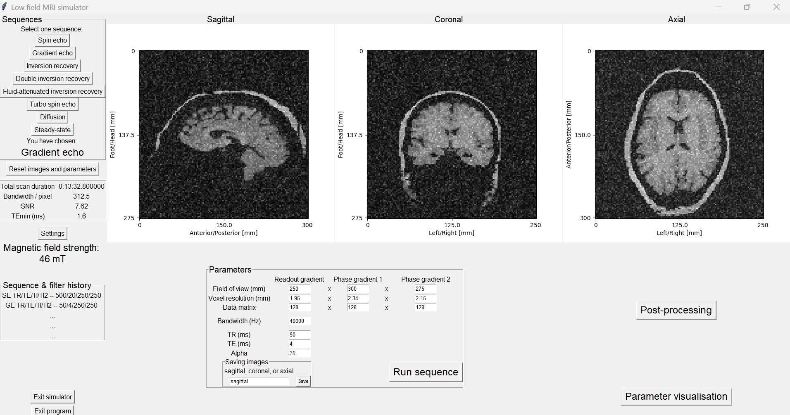
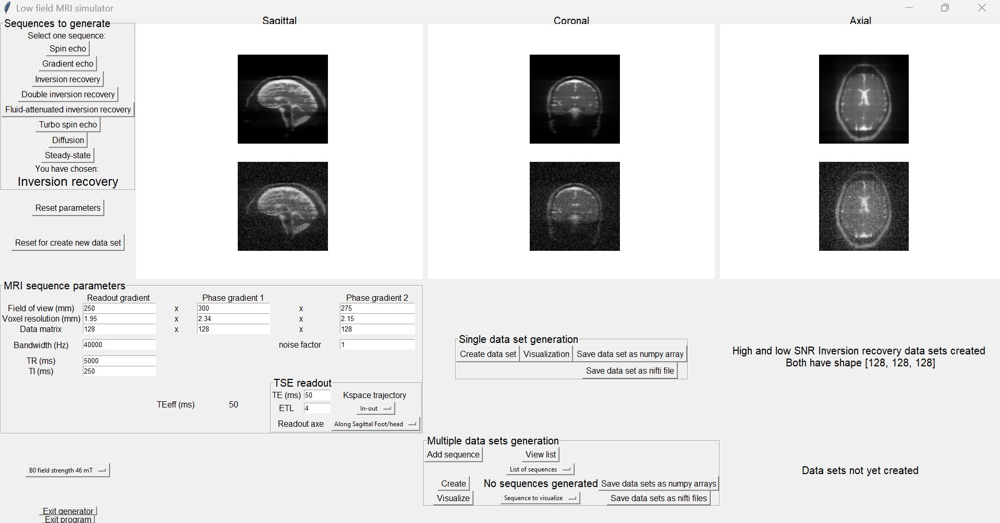

# Lo-Fi-Sim
Graphical interface allowing the user to simulate low and middle field cranial MRI and generate 3D images with high and low SNR. The possible MRI sequences that can be simulated are: spin-echo, gradient-echo, inversion recovery (IR), double IR, FLAIR, diffusion, SSFP, turbo-spin-echo (TSE) with three different kspace trajectories (linear, out-in, and in-out).

Instructions for running the graphical user interface (GUI)

Step 1)
Download the data zip file using this link: https://drive.google.com/file/d/1qUnMOWU84inbLAImg7PC623DG1QkRpJD/view?usp=sharing

Step 2) 
Unzip the data file and place it at the same level as the Images and Tutorial images files

Step 3)
Open a terminal window from where you can run Python. 
This can be from any Python environment (Anaconda, Spyder, PyCharm, etc.).
Example: type "Anaconda prompt" in the search bar, if you want the anaconda terminal window.

Step 4)
Navigate to the path/folder where the GUI package is saved on your computer.
This is done via the ``cd x`` command that will change your current directory to x.

Step 5)
Run the Gui.py file.
This can be done by typing the following command:
``python GUI_MRI.py``
and pressing enter. The GUI will appear shortly after.

The GUI can also be used without running the code via an application. This is an executable (.exe) file that can be used on Windows systems. As of now there is now application for Mac operators but softwares such as WineBottler (https://winebottler.kronenberg.org/) can be used to run Windows programs on Mac. The zip executable can be downloaded from this link: https://drive.google.com/file/d/1RgzTVxia0h1waa7WgR1aHdP7JC0Mg9G-/view?usp=drive_link

When the GUI opens, you can decide to use either the simulator of the generator. The simulator enables the user to interact with simulated data and different MRI parameters, apply some basic image processing tools, import and see the effect of B0, T1, and T2 relaxation maps.

The generator lets the user create either one or multiple simulated data sets. Every generated data comes with a high SNR image, without any noise, and one lower SNR image, the noise level can be defined by the user. As of now, the simulated data can be saved as numpy array or nifti files.

