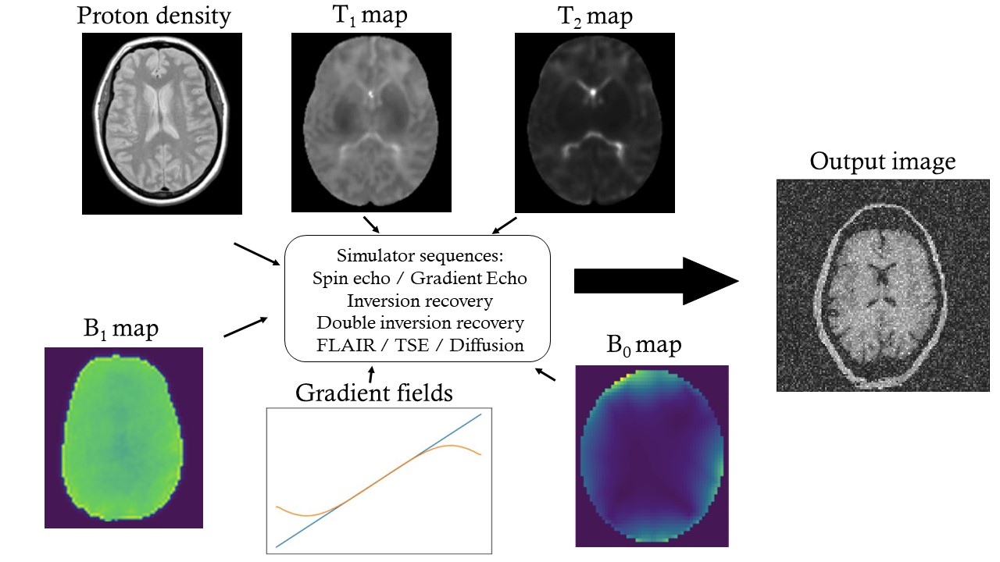
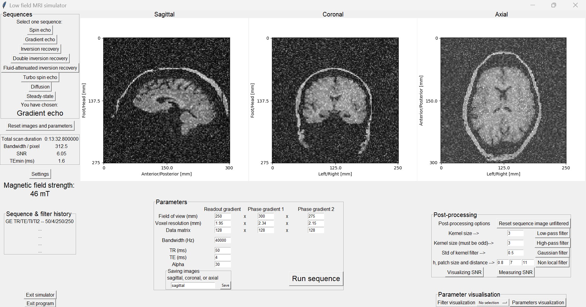
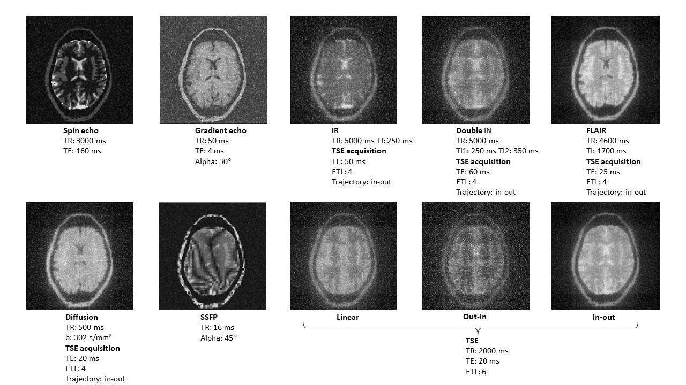
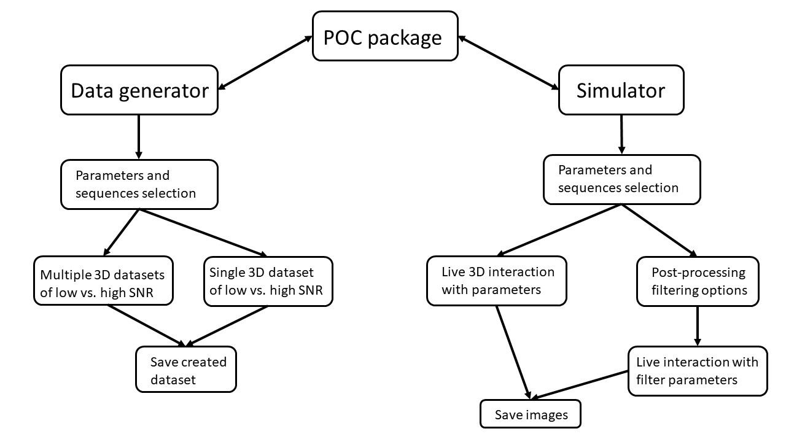

# Lo-Fi-Sim: A python-based open-source platform for image simulation and generation of point-of-care low-field (Lo-Fi) MRI

**Mathieu Mach and Andrew Webb**

C.J Gorter MRI Center, Department of Radiology, Leiden University Medical Center, Netherlands

# Summary

Recent studies have highlighted the lack of accessible and sustainable medical imaging infrastructure in large portions of the world [@ogbole_survey_2018, @geethanath_accessible_2019, @uc_framework_2022]. Mobile point-of-care (POC) low-field MRI is finding increasing application in lower and middle-income countries. Since resources are limited, simulation packages enable more widespread dissemination of the experience of operating such systems. To this end, a Python-based package specific to POC systems has been developed.

# Statement of need

MRI simulator packages, such as [4–8][@noauthor_corsmed_nodate, @noauthor_iaci_2018, @noauthor_scanlabmr_nodate, @tong_virtual_2019, @kose_blochsolver_2017], are accessible online and can simulate typical operating conditions and hardware for clinical 1.5 and 3 Tesla MRI systems. However, the situation is quite different for POC systems operating between 50 and 200 mT, in which there is very strong B0 inhomogeneity (typically hundreds of times higher than for a whole-body clinical system), low signal-to-noise ratio (SNR), and limited gradient strength and spatial resolution. In addition, tissue T1 relaxation times are much shorter, whereas T2 values are quite similar.

# Functionality

The Python POC package was designed to be a user-friendly graphical interface that enables an interactive and easy learning tool for MRI. The simulator enables the user to simulate MRI images from various MRI sequences (spin and gradient echo, double and single inversion recovery, FLAIR, unbalanced SSFP, diffusion, and turbo spin echo each with linear, in-out, and out-in as possible k-space trajectories). The default settings of the simulator are set to mimic a 46 mT Halbach array MRI. These settings can be easily changed to 1.5 and 3T B0, with associated relaxation time maps provided. Once the images have been simulated, the user can change any of the sequence parameters in an interactive 3D environment, providing a learning-by-doing experience.

The package also provides basic post-processing filtering steps, with the parameters being able to be set interactively.

If users want to use the package for generating images with different noise levels for input, for example, for their own training datasets for deep-learning applications, then there is an option to change the noise level and to save the outputted image datasets.

The simulation code is written in Python 3.7, can be run on a standard laptop computer, and uses the following freely downloadable packages: numpy, scipy, matplotlib, cv2, cmath, tkinter, and PIL.

**Requred inputs:**

Figure 1 shows a diagram of the inputs to the simulator programme. Morphometric data was derived from the ITis Duke model at 1 x 1 x 1 mm resolution. Since most POC studies are neurological, the tissue model was truncated at the level of the neck. Tissues were assigned to be white matter, gray matter, lipid, or cerebrospinal fluid with corresponding relaxation times from in vivo measurements at 46 mT and proton densities from the literature. Additional inputs to the simulation package are a 3-dimensional B1+ map, a 3-dimensional B0 map, and a 3-axis map of the magnetic field produced by the gradient coil: these can be measured or simulated, or any desired 3D map used as the input. The data formats are outlined in the Readme file in the github repository.

Figure 2 shows the graphical interface with the choice of pulse sequences on the left, data acquisition parameters in the centre, and post-processing options on the right. The simulated images are shown in three orthogonal views, with interactive scrolling through all views via the mouse or keyboard entry. A sequence history is also displayed so that the user can easily return to a set of previously-used data acquisition parameters.

# Results

Image simulation

Figure 3 shows image outputs from a number of different sequences, including artifacts associated with different data acquisition schemes, for example the banding artifacts in the balanced steady state free precession (SSFP) sequence due to the relatively strong B0 inhomogeneity and long TR time of 16 ms. By inputting different B0 maps, the user can see the effect of these on the final image.

Graphical interface architecture

Figure 4 shows the structure of Lo-Fi-Sim and the global workflow for creating images and datasets. Simulated data can be saved as 2D PNG images in the simulator and as either 3D numpy arrays or 3D NIFTI files in the generator. The simulator offers a live and 3D interaction with MRI parameters and some basic image post-processing filters, enabling the user to see the effects of those on the images. The generator always saves high and low SNR data, creating pairs of images.

# Conclusion

This work represents an initial implementation of a simple simulation package especially designed for low-field POC MRI systems. Compared to typical clinical scanners, effects such as B1 interactions with the body are negligible and subject-independent, whereas B0 inhomogeneity as well as limited gradient strength, are much more important to consider. The POC package has been designed to be used both as an educational system to offer an easy, free, interactive, quick MRI experience with various sequences and field strength, and as a fast dataset generator of high and low SNR 3D images that can be used for low-field image denoising research.

# Code availability

Code and .exe application are available at [https://github.com/mathieumach/Lowfield-simulator-and-generator/tree/main].

# Acknowledgements

This project has received funding from Horizon 2020 ERC Advanced PASMAR 101021218.

# References

1\. Ogbole, G. I., Adeyomoye, A. O., Badu-Peprah, A., Mensah, Y. & Nzeh,

D. A. (2018), Survey of magnetic resonance imaging availability in West Africa. The

Pan African Medical Journal, 30, 240. doi:[10.11604/pamj.2018.30.240.14000](https://doi.org/10.11604%2Fpamj.2018.30.240.14000)

2\. Geethanath, S. & Vaughan Jr., J. T. (2019) Accessible magnetic resonance imaging:

A review. Journal of Magnetic Resonance Imaging, e65-e77. doi:10.1002/jmri.26638

3\. Uc, A. et al. (2023) A framework for advancing sustainable magnetic resonance

imaging access in Africa. NMR in Biomedicine 36, e4846–e4846. doi:10.1002/nbm.4846

4\. Corsmed - MRI Simulator Corsmed. <https://www.corsmed.com/mrisimulator/>

(2023).

5\. ScanLabMR – MRI Training, Education, and Simulator Software. Scan-

LabMR. <https://scanlabmr.com/> (2023).

6\. IACI MRI Simulation Software — Psychology Software Tools Psychology

Software Tools—Solutions for Research, Assessment, and Education. https:

//pstnet.com/products/iaci-mri-simulation-software/ (2023).

7\. Tong, G., Geethanath, S., Jimeno M.M., Quian, E., Ravi K.S., Girish, N., and Vaughan, J.T. (2019). Virtual scnner: MRI on a browser. _JOSS_, 4 (43), 1637. doi:10.21105/joss.01637

8\. Kose R., and Kose, K. (2017). BlochSolverL a GPU-optimized fast 3D MRI simulator for experimentally compatible pulse sequences. Journal of Magnetic Resonance, 281, 51-65. doi: 10.1016/j.jmr.2017.05.007.
